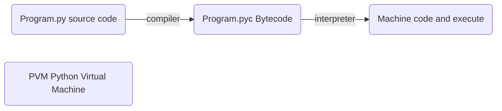
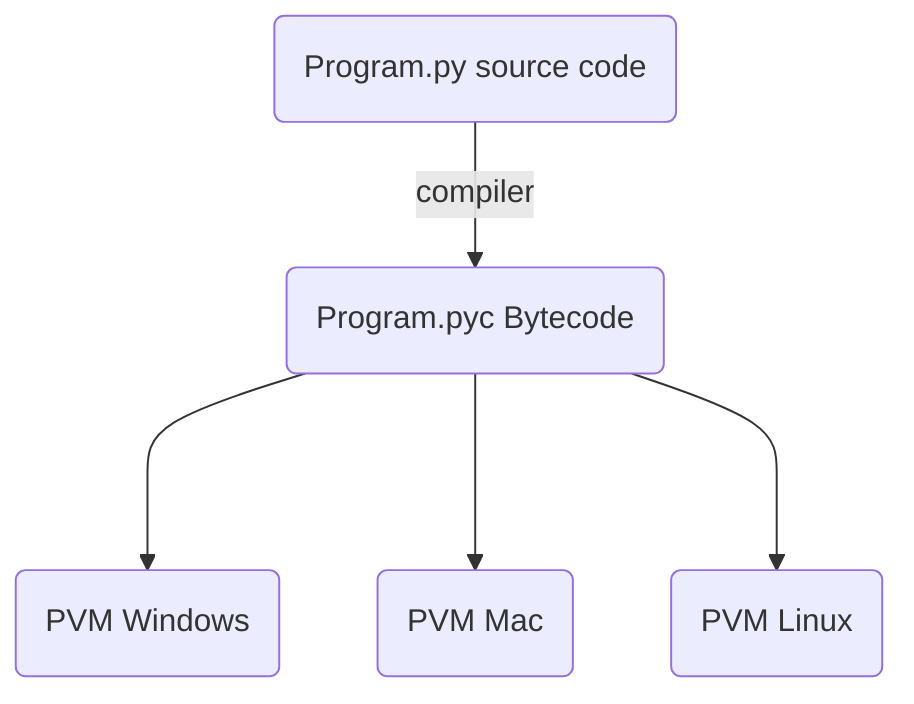

## Introduction to Python

#### 1. What does it mean by programming?
- We human beings use languages for communication. We use the languages like English, Hindi, French. These are the natural languages. So we use these languages for communication.
Likewise, machines also have their languages. And that language we call it as machine language. And this machine works in number system that is binary number system that is in the form of zeros and ones like zeros and ones. Whatever the value may be, it may be either 0 or 1. So the language is in the form of zeros and ones only.

##### Now what is programming?
- Programming means a step by step procedure for solving any problem. So when you write a procedure, what language you use. the language used for writing the step-by-step procedure is called as programming language.

#### 2. Types of Programming languages
- These are again categorized into general purpose, special purpose and scripting.
1. general purpose?
   - Language can be used for writing various types of programs like desktop application, web application, cloud application, enterprise application, mobile application, telecommunication, telecom application system programming, so on. in that we have the languages as C, C plus plus Java, C sharp python.
1. special purpose
   - for web development, mobile programming, etc
1. Scripting
   - html, css, javascript

#### 3. Compiler and interpreter
##### Compiler vs interpreter

|No.| Compiler                                                                                                                                                 | interpreter                                                                                                                                           |
|---|----------------------------------------------------------------------------------------------------------------------------------------------------------|-------------------------------------------------------------------------------------------------------------------------------------------------------|
|1.| Scans the entire program and translates it as a whole into machine code.                                                                                 | Translates program one statement at a time.                                                                                                           |
|2.| Compilers usually take a large amount of time to analyze the source code. However, the overall execution time is comparatively faster than interpreters. | Interpreters usually take less amount of time to analyze the source code. However, the overall execution time is comparatively slower than compilers. |
|3.| Programming languages like C, C++ use compilers.| Programming languages like JavaScript, Ruby use interpreters.|

#### Then What is Hybrid programming languages like python, Java

##### Python platform independent / portable

#### 4.Programming Methodologies
##### Procedural Programming
- Problem is broken down into procedures, or blocks of code that perform one task each. All procedures taken together form the whole program. It is suitable only for small programs that have low level of complexity.

##### Object-oriented Programming
- Here the solution revolves around entities or objects that are part of problem. The solution deals with how to store data related to the entities, how the entities behave and how they interact with each other to give a cohesive solution.

##### Modular
- The problem is broken down into smaller units, which may be further broken down into even smaller units. Each unit is called a module. Each module is a self-sufficient unit that has everything necessary to perform its task.

#### 5. Features of Python
1. Simple/ Expressive
1. Easy to Learn
1. Scripting Language
1. Open Source
1. General Purpose
1. Interpreted(Hybrid)
1. Platform Independent
1. Portable
1. Procedural and Object-oriented
1. Dynamically Typed
1. Extensible
1. Embeddable
1. Hug Library
1. Scalable

#### 6. Areas of Programming
1. AI
1. Machine Learning
1. Data Science
1. GUI Programming
1. Web Programming
1. Database Programming
1. Enterprise Applications
1. Network Programming
1. Game Development
1. Multithreading Programming
1. Mobile Applications